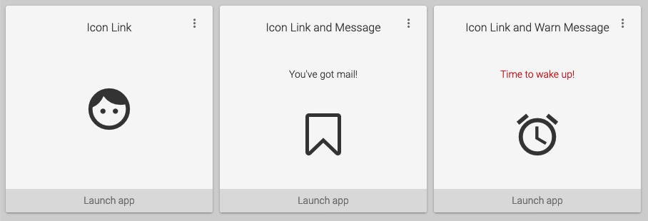

# myuw-card



## Getting Started

Import and include the component as follows:

```html
<script type="module" src="https://cdn.my.wisc.edu/@myuw-web-components/myuw-card@latest/myuw-card.min.mjs"></script>

<!-- fallback for browsers without ES2015 module support -->
<script nomodule src="https://cdn.my.wisc.edu/@myuw-web-components/myuw-card@latest/myuw-card.min.js"></script>

<myuw-card-frame>
  <myuw-card-header>
    Course Search and Enroll
  </myuw-card-header>
  <myuw-card-content>
    <myuw-icon-link href="https://www.google.com">
      
    </myuw-icon-link>
  </myuw-card-content>
  <myuw-card-footer href="https://www.google.com">
    Launch full app
  </myuw-card-footer>
</myuw-card-frame>
```

_Note:_ The evergreen "latest" version can be used for convenience, but in production settings it is
recommended to use the latest [release version](https://github.com/myuw-web-components/myuw-card/releases)
specifically, and upgrade only after testing!

### Composable Card Layouts

MyUW Card layouts are composable, which enables a degree of flexibility with widget content. The example
above shows the basic usage, but it is possible to mix and match content blocks to create new widget
variations.

All content blocks must be placed inside a `<myuw-card-content></myuw-card-content>` component.

#### Basic icon link

```html
<myuw-card-content>
  <myuw-icon-link href="https://wisc.edu">
    
  </myuw-icon-link>
<myuw-card-content>
```

#### Icon link with message

```html
<myuw-card-content>
  <myuw-card-message>Your message here</myuw-card-message>
  <myuw-icon-link href="https://wisc.edu">
    
  </myuw-icon-link>
<myuw-card-content>
```

#### List of links with message

```html
<myuw-card-content>
  <myuw-card-message variant="warn">
    You need to click these buttons!
  </myuw-card-message>
  <myuw-fab-link href="https://www.google.com">
    
    <p>Deposit money</p>
  </myuw-fab-link>
  <myuw-fab-link href="https://www.google.com">
    
    <p>Report lost card</p>
  </myuw-fab-link>
</myuw-card-content>
```

#### Two rows of list of links

```html
<myuw-card-content>
  <myuw-link-list>
    <myuw-fab-link href="https://www.google.com">
      
      <p>Jump around</p>
    </myuw-fab-link>
    <myuw-fab-link href="https://www.google.com">
      
      <p>Sit on Terrace</p>
    </myuw-fab-link>
  </myuw-link-list>
  <myuw-link-list>
    <myuw-fab-link href="https://www.google.com">
      
      <p>Deposit money</p>
    </myuw-fab-link>
    <myuw-fab-link href="https://www.google.com">
      
      <p>Report lost card</p>
    </myuw-fab-link>
  </myuw-link-list>
</myuw-card-content>
```

### Customization

The following CSS variables are defined for customization:

| Variable               | Description                             | Default |
|------------------------|-----------------------------------------|---------|
|`--myuw-fab-color`      |FAB button background color              |`#0479a8`|
|`--myuw-fab-color-hover`|FAB button background color when hovering|`#034e6c`|

## Contributing

See also: [CONTRIBUTING](contributing.md)

### Developer Requirements

* [Node.js](https://nodejs.org/en/)
* [Yarn](https://yarnpkg.com/lang/en/) (optional but recommended)
* npm (if not using Yarn)

Install dependencies:

```sh
$ yarn install
# or
$ npm install
```

Run the development server:

```sh
$ yarn start
# or
$ npm start
```

Build modules to `dist/`:

```sh
$ yarn build
# or
$ npm run build
```

[ESLint](https://eslint.org/) and [Prettier](https://prettier.io/) will be install
and are already configured. It is recommended that you use them.
